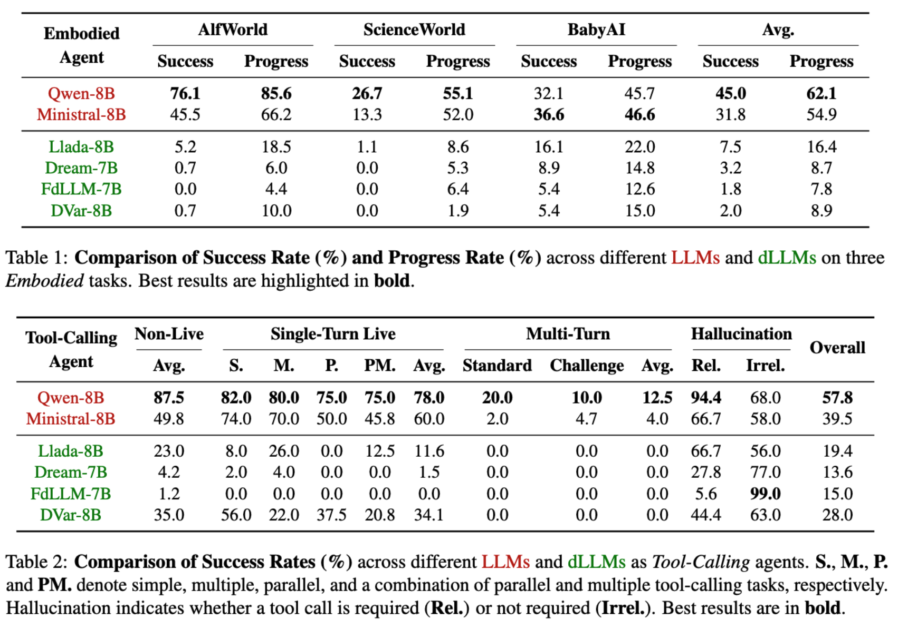
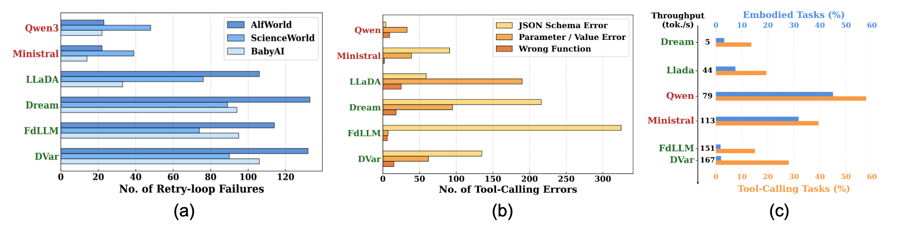
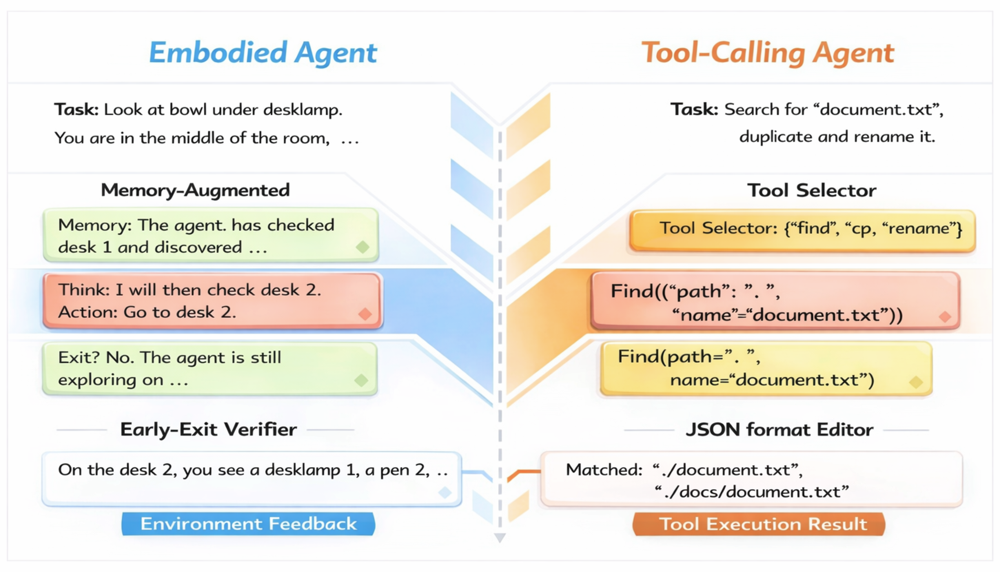
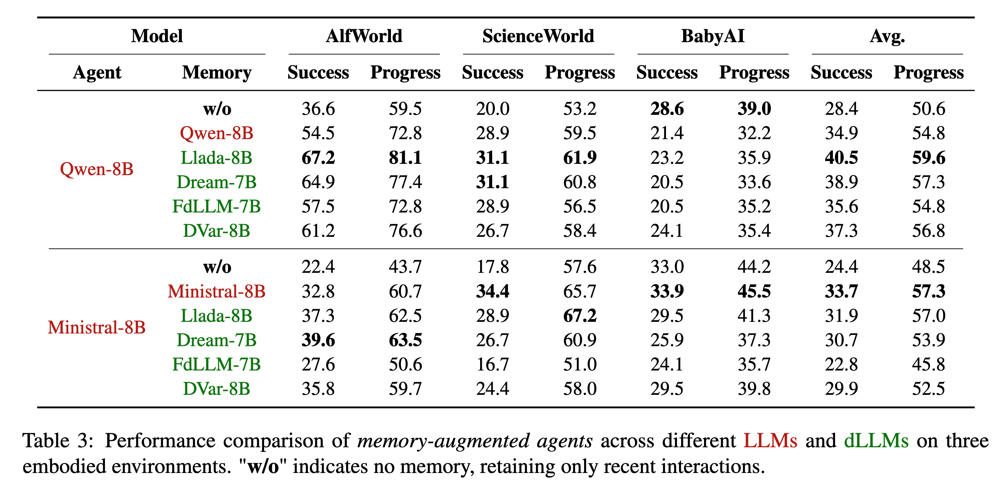
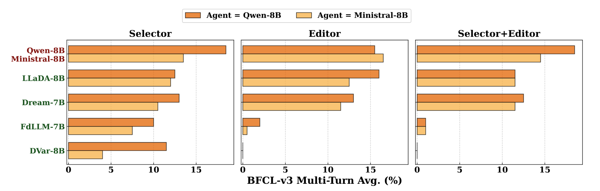

<div align="center">

  

  #  DiffuAgent

  ### The Bitter Lesson of Diffusion Language Models for Agentic Workflows: A Comprehensive Reality Check

  **Qingyu Lu<sup>1,3</sup>, Liang Ding<sup>2</sup>, Kanjian Zhang<sup>2</sup>, Jinxia Zhang<sup>1</sup>, Dacheng Tao<sup>3</sup>**

  <sup>1</sup>Southeast University, China &nbsp;|&nbsp;
  <sup>2</sup>Alibaba &nbsp;|&nbsp;
  <sup>3</sup>Nanyang Technological University, Singapore

  [](https://arxiv.org/pdf/2601.12979)
  [](https://coldmist-lu.github.io/DiffuAgent/)

</div>

---

## Failure Cases of dLLMs in Agentic Workflows

<p align="center">
  
</p>

- **In Embodied settings**, dLLMs suffer repeated attempts (**retry loops**), failing to branch under temporal feedback.
- **In Tool-Calling settings**, dLLMs fail to maintain **symbolic precision** (e.g., strict JSON schemas) under diffusion noise.

---

## TL;DR

- **Efficiency ≠ Agentic Effectiveness.** Despite low latency, diffusion-based LLMs (dLLMs) fail to serve as reliable agent backbones in both long-horizon **embodied** tasks and precision-critical **tool-calling** scenarios.

- **Systematic Agentic Failures.** dLLMs exhibit characteristic failure modes, including retry loops under temporal feedback and loss of symbolic precision (e.g., malformed JSON) under diffusion noise.

- **DiffuAgent Framework.** We introduce **DiffuAgent**, a unified and modular framework for evaluating dLLMs across embodied and tool-calling agentic workflows.

- **Where dLLMs Work.** dLLMs remain effective in non-causal auxiliary roles (e.g., memory summarization and tool selection), but require causal and logically grounded mechanisms to function as full agent backbones.

---

## Failure of dLLMs as Agent Backbones

<p align="center">
  
</p>

We compare dLLMs and autoregressive LLMs on embodied (AgentBoard) and tool-calling (BFCL) benchmarks.
The results show that dLLMs lag behind on both success/progress and tool-calling accuracy.

---

## Systematic Failure Modes of dLLMs

<p align="center">
  
</p>

**(a) Failure of Replan for embodied agents**: dLLMs exhibit significantly more frequent retry loops than LLMs.

**(b) Failure of Precision for tool-calling agents**: dLLMs are more prone to produce malformed JSON schemas.

**(c) Performance-Efficiency Trade-offs**: despite higher inference efficiency, dLLMs do not guarantee comparable agentic performance to autoregressive LLMs.

---

## DiffuAgent: Framework on Analyzing Agentic Behaviors in dLLMs

<p align="center">
  
</p>

To better understand the agentic potential of dLLMs, we introduce DiffuAgent, a novel evaluation framework that treats dLLMs as plug-and-play cognitive modules for augmenting LLM agents.

### Framework Components

- **For embodied agents**, we introduce a memory-augmented module for history compression and an early-exit verifier for global trajectory checking.

- **For tool-calling agents**, we include a tool selector over the library of available tools, and a JSON format editor.

### Quick Start

For detailed installation and setup instructions, see **[`DiffuAgent/Agentboard/installation.md`](DiffuAgent/Agentboard/installation.md)**.

**Setup**:
```bash
git clone git@github.com:Coldmist-Lu/DiffuAgent.git
cd DiffuAgent
# Follow installation.md for complete setup guide
```

> **Note:** Our BFCL experiments have been extended to v4. To reproduce v3 experiments, please use the v3 codebase.

> **Note:** We used Claude Code for automatic code optimization, which passed preliminary testing. If you encounter any issues during use, please contact us.

---

## Analysis of Agentic Behaviors in dLLMs

### Memory Augmentation

<p align="center">
  
</p>

**dLLMs are competitive memory modules** for memory-augmented agents.

### Early Exit Verification

<p align="center">
  
</p>

LLM Verifiers tend to trigger premature early exits, whereas **dLLMs terminate more reliably**.

### Tool-Calling Analysis

<p align="center">
  
</p>

dLLMs are **effective tool selectors** but **struggle as tool-call editors**.

---

## Citation

```bibtex
@article{lu2026diffuagent,
  title   = {The Bitter Lesson of Diffusion Language Models for Agentic Workflows: A Comprehensive Reality Check},
  author  = {Lu, Qingyu and Ding, Liang and Zhang, Kanjian and Zhang, Jinxia and Tao, Dacheng},
  journal = {arXiv preprint},
  year    = {2026}
}
```

---

<div align="center">

  © 2026 DiffuAgent

</div>
